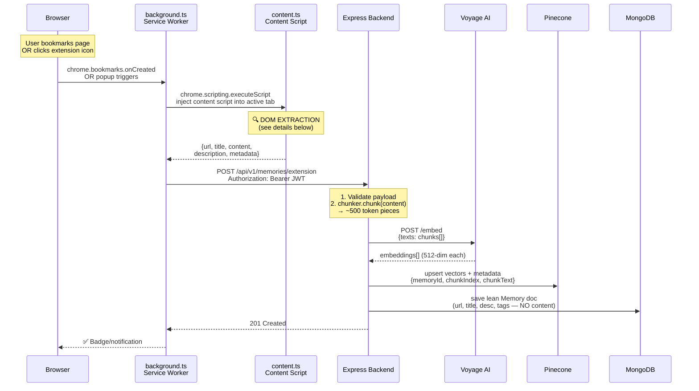
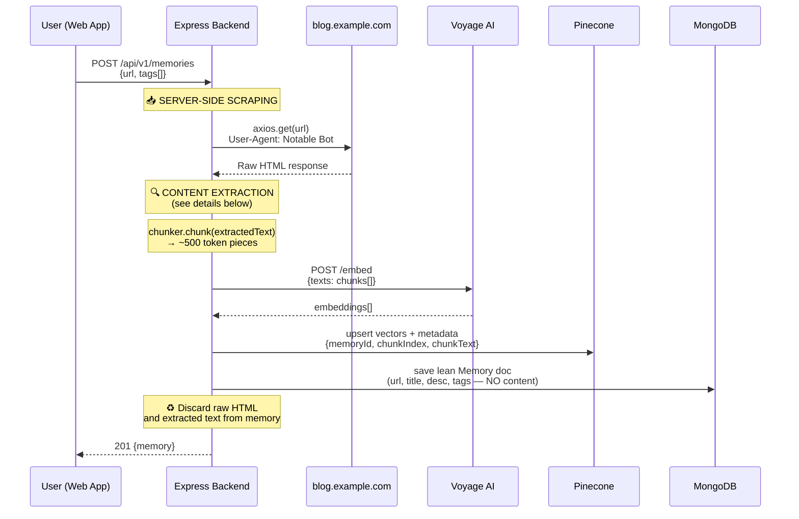
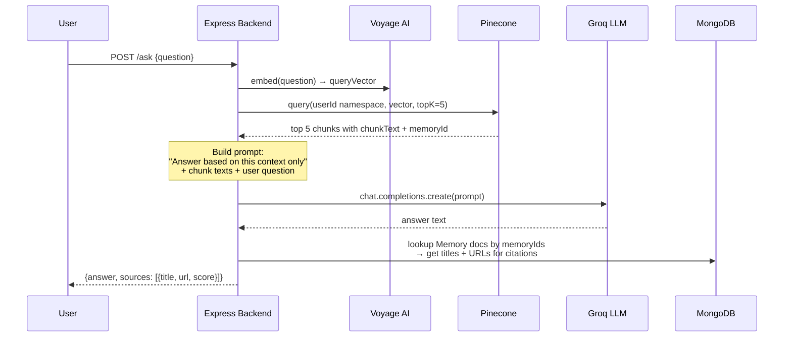
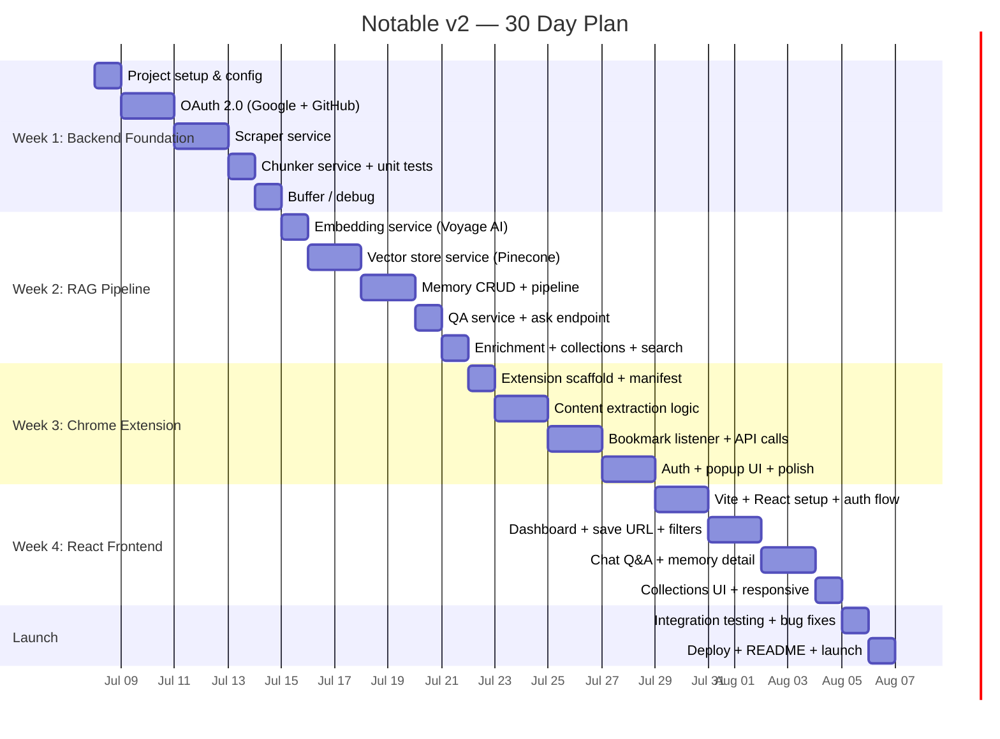

# Notable v2 — AI-Powered Bookmarks with RAG

Rebuild Notable into an AI-powered "memories" system. Two equal ingestion modes: **Web app** (user pastes a URL → backend scrapes content) and **Chrome extension** (reads rendered page DOM client-side → sends to backend). Both paths chunk, embed, and store content in a vector DB for natural language Q&A.

## Design Principles

1. **Minimal server load** — all heavy compute (embeddings, vector search, LLM) offloaded to free cloud APIs
2. **Lean storage** — MongoDB stores only display metadata (title, URL, tags). Chunk text lives in Pinecone vector metadata where queries happen. No bloated full-text fields.
3. **Two ingestion paths** — web app (server scraping for public URLs) + extension (for authenticated/JS-heavy sites like Twitter, LinkedIn)
4. **Backend first** — build the API + RAG pipeline first, then extension, then frontend

---

## The Scraping Problem & Solution

| Site | Server-Side Scraping | Chrome Extension |
|---|---|---|
| **Twitter/X** | ❌ Blocked (JS-rendered, auth required, bot detection) | ✅ Reads rendered DOM, user already logged in |
| **Reddit** | ⚠️ Flaky (Cloudflare, rate limits) | ✅ Full page content available |
| **YouTube** | ⚠️ Transcript only via API | ✅ Can read video description, comments, transcript if expanded |
| **LinkedIn** | ❌ Aggressive anti-bot | ✅ User is authenticated, full content visible |
| **Medium/Substack** | ✅ Works | ✅ Works |
| **Generic blogs/docs** | ✅ Works | ✅ Works |

**Two ingestion paths:**
- **Web app / API**: User pastes a URL → backend scrapes it server-side (`axios + cheerio + readability`). Works great for public/static pages (blogs, docs, Wikipedia, Medium, Substack).
- **Chrome extension**: User clicks save or bookmarks a page → extension reads the rendered DOM → sends extracted text to backend. Required for authenticated/JS-heavy sites (Twitter, Reddit, LinkedIn, YouTube).

---

## Tech Stack

| Layer | Technology | Cost |
|---|---|---|
| **Runtime** | Node.js + TypeScript | Free |
| **Framework** | Express.js | Free |
| **Auth** | OAuth 2.0 (Google) via Passport.js + JWT | Free |
| **Database** | MongoDB + Mongoose | Free (Atlas) |
| **Vector Store** | Pinecone (serverless, free tier) | Free (2GB) |
| **Embeddings** | Voyage AI API (`voyage-3-lite`) | Free (200M tokens) |
| **LLM Q&A** | Groq SDK (`llama-3.3-70b-versatile`) | Free tier |
| **Server Scraping** | `axios` + `cheerio` + `@mozilla/readability` + `jsdom` | Free |
| **Extension** | Chrome Manifest V3 (TypeScript) | Free |
| **Frontend** | React + Vite + TypeScript (Phase 2) | Free |

---

## User Review Required

> [!IMPORTANT]
> **Full rebuild**: Nukes existing `backend/src/` code and rebuilds from scratch.

> [!IMPORTANT]
> **API keys needed** (all free, no credit card):
> - **Google OAuth** — [console.cloud.google.com](https://console.cloud.google.com) (create OAuth 2.0 credentials)
> - **GitHub OAuth** — [github.com/settings/developers](https://github.com/settings/developers) (create OAuth App)
> - **Groq** — [console.groq.com](https://console.groq.com)
> - **Voyage AI** — [dash.voyageai.com](https://dash.voyageai.com)
> - **Pinecone** — [app.pinecone.io](https://app.pinecone.io)

---

## Proposed Changes

### Phase 1A: Backend Core

---

### Project Setup

#### [DELETE] All files in `backend/src/`

Delete existing source: `Routes/`, `controllers/`, `models/`, `middleware/`, `index.ts`, `utils.ts`

#### [MODIFY] [package.json](file:///home/sumedh/Code/Notable/backend/package.json)

```json
{
  "name": "notable-backend",
  "version": "2.0.0",
  "type": "module",
  "scripts": {
    "dev": "tsx watch src/index.ts",
    "build": "tsc",
    "start": "node dist/index.js"
  },
  "dependencies": {
    "express": "^4.21.2",
    "mongoose": "^8.13.1",
    "cors": "^2.8.5",
    "dotenv": "^16.4.7",

    "jsonwebtoken": "^9.0.2",
    "zod": "^3.24.2",
    "passport": "^0.7.0",
    "passport-google-oauth20": "^2.0.0",
    "passport-github2": "^0.1.12",
    "express-session": "^1.18.0",
    "groq-sdk": "latest",
    "youtube-transcript": "^2.0.0",
    "@pinecone-database/pinecone": "latest",
    "axios": "^1.8.4",
    "cheerio": "^1.0.0",
    "@mozilla/readability": "^0.5.0",
    "jsdom": "^25.0.0",
    "uuid": "^11.0.0"
  },
  "devDependencies": {
    "typescript": "~5.7.2",
    "@types/express": "^5.0.1",

    "@types/jsonwebtoken": "^9.0.9",
    "@types/passport": "^1.0.17",
    "@types/passport-google-oauth20": "^2.0.16",
    "@types/passport-github2": "^1.2.9",
    "@types/express-session": "^1.18.0",
    "@types/jsdom": "^21.1.7",
    "@types/uuid": "^10.0.0",
    "tsx": "^4.19.0"
  }
}
```

#### [NEW] `backend/tsconfig.json`
- `target: ES2022`, `module: NodeNext`, `moduleResolution: NodeNext`
- `strict: true`, `outDir: ./dist`, `rootDir: ./src`

#### [MODIFY] [.env](file:///home/sumedh/Code/Notable/backend/.env)
```env
PORT=5000
MONGODB_URL=<your-mongodb-uri>
JWT_SECRET=<your-jwt-secret>
SESSION_SECRET=<random-string>
GOOGLE_CLIENT_ID=<from-google-cloud-console>
GOOGLE_CLIENT_SECRET=<from-google-cloud-console>
GOOGLE_CALLBACK_URL=http://localhost:5000/api/v1/auth/google/callback
GITHUB_CLIENT_ID=<from-github-developer-settings>
GITHUB_CLIENT_SECRET=<from-github-developer-settings>
GITHUB_CALLBACK_URL=http://localhost:5000/api/v1/auth/github/callback
GROQ_API_KEY=<from-console.groq.com>
VOYAGE_API_KEY=<from-dash.voyageai.com>
PINECONE_API_KEY=<from-app.pinecone.io>
PINECONE_INDEX_NAME=notable
```

---

### Authentication (Google + GitHub OAuth 2.0 + JWT)

#### [NEW] `backend/src/models/user.model.ts`
```typescript
{
  provider: 'google' | 'github';  // Which OAuth provider
  providerId: string;              // Google sub ID or GitHub user ID
  email: string;                   // From OAuth profile
  name: string;                    // Display name
  avatar: string;                  // Profile picture URL
  createdAt: Date;
}
```
> [!NOTE]
> No password field — pure OAuth. The backend issues its own JWT after OAuth succeeds. Both extension and frontend use this JWT for all subsequent API calls.

#### [NEW] `backend/src/config/passport.ts`
- Configure **two** Passport strategies:
  - `passport-google-oauth20` — scopes: `['profile', 'email']`
  - `passport-github2` — scopes: `['user:email']`
- Both callbacks: find user by `{ provider, providerId }` or create new → issue JWT

#### [NEW] `backend/src/routes/auth.routes.ts`
| Method | Endpoint | Description |
|---|---|---|
| GET | `/api/v1/auth/google` | Initiate Google OAuth flow |
| GET | `/api/v1/auth/google/callback` | Google redirects here → issue JWT |
| GET | `/api/v1/auth/github` | Initiate GitHub OAuth flow |
| GET | `/api/v1/auth/github/callback` | GitHub redirects here → issue JWT |
| GET | `/api/v1/auth/me` | Get current user from JWT |

#### [NEW] `backend/src/controllers/auth.controller.ts`
- Google callback handler: find/create user → sign JWT → redirect with token
- `me` endpoint: decode JWT, return user profile

#### [NEW] `backend/src/middleware/auth.middleware.ts`
- Verify JWT from `Authorization: Bearer <token>` header
- Attach `userId` to request

---

### Data Models

#### [NEW] `backend/src/models/memory.model.ts`

> [!TIP]
> **Lean by design** — no full text stored in MongoDB. Chunk text lives only in Pinecone vector metadata. MongoDB holds just enough for listing/displaying memories.

```typescript
{
  url: string;                // Original URL (unique per user)
  title: string;              // Page title (scraped or from extension)
  description: string;        // Auto-generated summary via LLM
  contentType: string;        // 'article' | 'tweet' | 'video' | 'reddit' | 'generic'
  source: 'extension' | 'scraper';  // How content was ingested
  status: 'pending' | 'processing' | 'ready' | 'failed';  // Pipeline status
  tags: string[];             // Auto-generated + user-defined tags
  collections: ObjectId[];    // Collections this memory belongs to
  chunkCount: number;         // How many chunks were embedded
  userId: ObjectId;           // Owner
  errorMessage?: string;      // If status is 'failed', why
  createdAt: Date;
  metadata: {
    ogImage?: string;         // Preview image for display
    author?: string;
    siteName?: string;
    favicon?: string;
  }
}
```

> [!NOTE]
> **Unique constraint**: `{ url, userId }` compound unique index prevents duplicate bookmarks. If a duplicate URL is submitted, the API returns the existing memory or offers to re-scrape.

#### [NEW] `backend/src/models/collection.model.ts`
```typescript
{
  name: string;               // e.g., "AI Research", "Recipes"
  description?: string;       // Optional description
  userId: ObjectId;           // Owner
  createdAt: Date;
}
```

---

### RAG Pipeline Services

#### [NEW] `backend/src/services/scraper.service.ts`
- **Used for web app URL submissions** — user pastes a URL on the site, backend scrapes it
- **Extracts ONLY the core content** — no replies, likes, engagement metrics, sidebar, navigation
- **Site-specific strategies**:

| Site | Server Strategy | What's Extracted |
|---|---|---|
| **Reddit** | Append `.json` to URL → parse JSON response → `data.children[0].data.selftext` + `title` | Post title + body text only. No comments, no votes. |
| **YouTube** | `youtube-transcript` package → captions, **capped at first ~5 minutes** | Video title + description + first 5 min of transcript |
| **Generic / Blogs** | `axios` → `jsdom + @mozilla/readability` → article text | Article body text only. Readability strips nav/ads/footer. |
| **Twitter/X** | ❌ Won't work server-side (JS-rendered) | Falls back to `status: 'failed'` with message "Use the extension for this site" |
| **LinkedIn** | ❌ Won't work server-side (auth required) | Same fallback |

- Cheerio fallback for non-article pages that Readability can't parse
- Returns: `{ title, content, description, metadata }`
- Content is passed to chunker → embedder → Pinecone, then **discarded** (not stored in MongoDB)

#### [NEW] `backend/src/services/chunker.service.ts`
- Input: text string → Output: `Array<{ text, index }>`
- ~500 token chunks with ~50 token overlap
- Split by paragraphs, then merge small ones, split large ones
- Pure string ops — negligible CPU

#### [NEW] `backend/src/services/embedding.service.ts`
- Wraps **Voyage AI REST API** via `fetch` (no SDK — direct HTTP calls)
- Model: `voyage-3-lite` (512 dimensions)
- `embed(texts: string[]): Promise<number[][]>`
- Batches up to 128 texts per call
- Server load: zero (HTTP POST to `https://api.voyageai.com/v1/embeddings`)

#### [NEW] `backend/src/services/vector-store.service.ts`
- Wraps **Pinecone** client
- Single index `notable`, namespace per user (`userId` as namespace)
- `upsertChunks(userId, memoryId, chunks, embeddings)` — upsert with metadata `{ memoryId, chunkIndex, chunkText }`
- `query(userId, embedding, topK)` — returns matching chunks with scores
- `querySimilar(userId, memoryId, topK)` — find memories similar to a given memory (for "Related" feature)
- `deleteByMemory(userId, memoryId)` — cleanup on memory delete
- Server load: zero (HTTP calls)

#### [NEW] `backend/src/services/qa.service.ts`
- Input: `{ question, userId }`
- Flow:
  1. Embed question via Voyage AI
  2. Query Pinecone for top-5 chunks
  3. Build prompt with context + question
  4. Call Groq (`llama-3.3-70b-versatile`)
  5. Return `{ answer, sources[] }`
- Server load: zero (three API calls)

#### [NEW] `backend/src/services/enrichment.service.ts`
- Called **after** a memory is saved and vectors are stored (status transitions: `processing` → `ready`)
- **Auto-tagging**: Sends first ~2000 chars of content to Groq with prompt: *"Generate 3-5 relevant tags for this content"* → saves tags to Memory doc
- **Auto-summary**: Sends first ~2000 chars to Groq with prompt: *"Summarize this in 2-3 sentences"* → saves as `description` field
- Both are single Groq API calls — minimal latency
- On failure: memory still saves with `status: 'ready'`, just without auto-tags/summary

---

### API Routes

#### [NEW] `backend/src/routes/memory.routes.ts`
| Method | Endpoint | Description |
|---|---|---|
| POST | `/api/v1/memories` | Save memory — accepts URL (scrapes server-side). Returns existing if duplicate URL. |
| POST | `/api/v1/memories/extension` | Save memory from extension — accepts pre-extracted content |
| GET | `/api/v1/memories` | List user's memories (paginated, filterable) |
| GET | `/api/v1/memories/:id` | Get single memory details |
| GET | `/api/v1/memories/:id/related` | Get related/similar memories |
| GET | `/api/v1/memories/search?q=&type=&tags=&from=&to=` | Search + filter memories |
| POST | `/api/v1/memories/:id/rescrape` | Re-scrape and re-embed an existing memory |
| DELETE | `/api/v1/memories/:id` | Delete memory + Pinecone vectors |

#### [NEW] `backend/src/controllers/memory.controller.ts`
- `createFromUrl`: Check duplicate → scrape → chunk → embed → store → enrich (auto-tag + auto-summary)
- `createFromExtension`: Check duplicate → chunk → embed → store → enrich
- `list`: Paginated, supports `?type=tweet&tags=javascript&sort=createdAt`
- `search`: MongoDB text search on title/description/tags + filters (contentType, date range, tags)
- `getRelated`: Query Pinecone with memory's vectors, exclude self, return top-5 similar memories
- `rescrape`: Re-run scraping + chunking + embedding pipeline for an existing memory
- `get`, `delete`

#### [NEW] `backend/src/routes/collection.routes.ts`
| Method | Endpoint | Description |
|---|---|---|
| POST | `/api/v1/collections` | Create a collection |
| GET | `/api/v1/collections` | List user's collections |
| PUT | `/api/v1/collections/:id` | Update collection name/description |
| DELETE | `/api/v1/collections/:id` | Delete collection (memories remain) |
| POST | `/api/v1/collections/:id/memories` | Add a memory to a collection |
| DELETE | `/api/v1/collections/:id/memories/:memoryId` | Remove memory from collection |

#### [NEW] `backend/src/controllers/collection.controller.ts`
- CRUD for collections + add/remove memories

#### [NEW] `backend/src/routes/ask.routes.ts`
| Method | Endpoint | Description |
|---|---|---|
| POST | `/api/v1/ask` | Ask a question across all memories |

#### [NEW] `backend/src/controllers/ask.controller.ts`
- `{ question }` → QA service → `{ answer, sources[] }`

---

### Entry Point

#### [NEW] `backend/src/index.ts`
- Express app setup (CORS, JSON, sessions)
- Passport initialization
- MongoDB connection
- Mount routes: auth, memories, ask
- Error handler
- **No model loading** — all ML is cloud-based

---

### Project Structure

```
backend/
├── src/
│   ├── index.ts
│   ├── config/
│   │   └── passport.ts              # Google + GitHub OAuth strategies
│   ├── models/
│   │   ├── user.model.ts
│   │   ├── memory.model.ts
│   │   └── collection.model.ts
│   ├── services/
│   │   ├── scraper.service.ts       # URL → text (+ YouTube transcript)
│   │   ├── chunker.service.ts       # Text → chunks
│   │   ├── embedding.service.ts     # Voyage AI REST API
│   │   ├── vector-store.service.ts  # Pinecone API
│   │   ├── enrichment.service.ts    # Auto-tagging + auto-summary (Groq)
│   │   └── qa.service.ts            # RAG Q&A (Groq)
│   ├── controllers/
│   │   ├── auth.controller.ts
│   │   ├── memory.controller.ts
│   │   ├── collection.controller.ts
│   │   └── ask.controller.ts
│   ├── routes/
│   │   ├── auth.routes.ts
│   │   ├── memory.routes.ts
│   │   ├── collection.routes.ts
│   │   └── ask.routes.ts
│   ├── middleware/
│   │   └── auth.middleware.ts
│   └── utils/
│       └── logger.ts
├── package.json
├── tsconfig.json
└── .env
```

---

### Phase 1B: Chrome Extension (after backend is working)

> [!IMPORTANT]
> **Bookmarks are the source of truth.** Every memory in Notable corresponds to a bookmark. The extension captures content both when the user clicks the extension icon AND when they use Chrome's native bookmark feature.

#### [NEW] `extension/` directory at project root

```
extension/
├── manifest.json          # Manifest V3
├── background.ts          # Service worker — bookmark listener + API calls
├── content.ts             # Content script — reads page DOM
├── popup.html             # Extension popup UI
├── popup.ts               # Popup logic (save button, tag input, status)
├── options.html           # Settings page (API URL, login)
├── options.ts
├── utils/
│   └── extractor.ts       # Smart content extraction logic
└── icons/
```

**Two Triggers:**
- **Manual save**: User clicks extension icon → popup shows → user adds optional tags → confirms → content extracted and sent to backend
- **Auto bookmark capture**: `chrome.bookmarks.onCreated` listener fires whenever user bookmarks ANY page → extension injects content script → extracts content → sends to backend automatically

**Auth**: Stores JWT in `chrome.storage.local`. User logs in once via the OAuth page opened from the extension options.

---

## Detailed Data Extraction Flows

### Scenario 1: User Bookmarks a Site (Extension)

User is browsing Twitter, sees a useful tweet, and bookmarks the page (or clicks the extension icon).

#### Step-by-step:



#### 🔍 What the Content Script Extracts (Core Content Only):

The content script runs **inside the page** where the user is already authenticated and JS has already rendered. It uses **site-specific selectors** to grab only the core content — no noise.

| Site | What's Extracted | DOM Selector Strategy |
|---|---|---|
| **X/Twitter** | Tweet text only (no replies, no likes/RT counts) | `[data-testid="tweetText"]` on the main tweet |
| **Reddit** | Post title + post body only (no comments, no votes) | `.Post` or `shreddit-post` content area |
| **YouTube** | Video title + description text | `#title h1` + `#description-inner` |
| **LinkedIn** | Post text only (no reactions, no comments) | `.feed-shared-update-v2__description` |
| **Medium/Substack** | Article body only | `article` tag content |
| **Generic** | Main article body via Readability heuristic | `<article>` → largest text block → `body.innerText` (stripped) |

#### Metadata (always extracted):
| Data | How It's Extracted |
|---|---|
| `url` | `window.location.href` |
| `title` | `document.title` |
| `description` | `meta[name="description"]` or first ~200 chars of content |
| `ogImage` | `meta[property="og:image"]` |
| `author` | `meta[name="author"]` or site-specific selector |
| `siteName` | `meta[property="og:site_name"]` |
| `favicon` | `link[rel="icon"]` |
| `contentType` | Inferred from URL hostname |

#### Extraction Rules:
```
1. Detect site from URL hostname
2. Use site-specific selector to get ONLY the core post/article content
3. Strip all engagement UI (like counts, share buttons, reply boxes)
4. Truncate to ~10,000 chars
5. If site-specific selector fails → fallback to generic extraction:
   a. Try <article> tag
   b. Try largest text-dense block
   c. Last resort: body.innerText with nav/footer/sidebar stripped
```

> [!TIP]
> **Why this works on Twitter/Reddit/LinkedIn**: The browser has already executed all JavaScript and the user is already logged in. The content script sees the exact same rendered page the user sees — no scraping needed. And because we use targeted selectors, we get ONLY the post content, not the surrounding noise.

---

### Scenario 2: User Pastes a Link on the Website

User is on the Notable web app and pastes `https://blog.example.com/useful-article` into the save input.

#### Step-by-step:



#### 🔍 What the Server Extracts (Site-Specific):

| Site | Strategy | What's Extracted |
|---|---|---|
| **Reddit** | `axios.get(url + '.json')` → parse JSON | Post title + `selftext` body. No comments. |
| **YouTube** | `youtube-transcript` package | Video title + description + first ~5 min transcript |
| **Generic** | `axios.get(url)` → `JSDOM` → `Readability` | Article body text only (nav/ads/footer stripped) |
| **Fallback** | `cheerio` | `$('body').text()` with element stripping |
| **X/LinkedIn** | ❌ Not supported server-side | Returns `status: 'failed'` with "Use extension" message |

#### What Gets Stored Where:

| Data | Stored In | Purpose |
|---|---|---|
| `url`, `title`, `description`, `tags`, `contentType`, `metadata` | **MongoDB** | Display in UI, list memories, basic search |
| Chunk text + embedding vectors | **Pinecone** (metadata field `chunkText`) | Semantic search, RAG Q&A retrieval |
| Raw HTML / full extracted text | **Nowhere** — discarded after processing | Not needed once chunks are embedded |

> [!WARNING]
> **Server-side scraping limitations**: Works for Reddit (via `.json`), YouTube (via transcript), blogs, docs, Wikipedia, Medium, Substack. Does **NOT** work for Twitter/X or LinkedIn — for those, users must use the Chrome extension.

---

### Scenario 3: Ask a Question



---

## Delivery Order

| Phase | Scope | What's Built |
|---|---|---|
| **1A** | Backend Core | Auth (OAuth 2) + Models + Scraper + RAG pipeline + REST API |
| **1B** | Extension | Chrome MV3 extension with manual save + auto bookmark capture |
| **2** | Frontend | React dashboard, chat UI, memory management |

> [!NOTE]
> Starting with **Phase 1A** (backend) right now. Extension and frontend come after.

---

## Verification Plan

### Phase 1A Verification
```bash
# Build & start
npm run dev

# 1. OAuth flow — open in browser
open http://localhost:5000/api/v1/auth/google
# OR
open http://localhost:5000/api/v1/auth/github

# 2. After OAuth redirect, get JWT token from response

# 3. Save a memory (public URL, server-side scraping)
curl -X POST http://localhost:5000/api/v1/memories \
  -H "Authorization: Bearer <token>" \
  -H "Content-Type: application/json" \
  -d '{"url":"https://en.wikipedia.org/wiki/Node.js","tags":["nodejs"]}'

# 4. Save a memory (simulating extension payload)
curl -X POST http://localhost:5000/api/v1/memories/extension \
  -H "Authorization: Bearer <token>" \
  -H "Content-Type: application/json" \
  -d '{"url":"https://x.com/...", "title":"Tweet about OSS", "content":"Full tweet text...", "tags":["oss"]}'

# 5. List memories
curl http://localhost:5000/api/v1/memories \
  -H "Authorization: Bearer <token>"

# 6. Ask a question
curl -X POST http://localhost:5000/api/v1/ask \
  -H "Authorization: Bearer <token>" \
  -H "Content-Type: application/json" \
  -d '{"question":"What open source software was mentioned?"}'
```

### Manual Verification
- Save 2-3 URLs via the API → verify scraping works for public pages
- Save mock extension payloads → verify chunking and embedding pipeline
- Ask cross-source questions → verify RAG retrieves correct context
- Delete a memory → verify Pinecone vectors cleaned up
- Monitor server memory: should stay flat (no ML models loaded)

---

## 30-Day Project Plan

> [!NOTE]
> Start date: **Day 1 = today**. Each day assumes ~3-5 hours of focused work. Buffer time is built into the end of each week for debugging and unforeseen issues.



---

### Week 1: Backend Foundation (Days 1-7)

#### Day 1 — Project Setup & Configuration
- [ ] Nuke existing `backend/src/` code
- [ ] Update `package.json` with new dependencies
- [ ] Create `tsconfig.json` (strict, ES2022, NodeNext)
- [ ] Set up `.env` template with all required keys
- [ ] `npm install` + verify build works
- [ ] Create `src/index.ts` with Express skeleton (CORS, JSON, health endpoint)
- [ ] Create `src/utils/logger.ts`
- [ ] **Checkpoint**: `npm run dev` starts server, `GET /health` returns 200

#### Day 2 — OAuth 2.0: Google Provider
- [ ] Create `src/models/user.model.ts` (provider, providerId, email, name, avatar)
- [ ] Create `src/config/passport.ts` with Google strategy
- [ ] Create `src/routes/auth.routes.ts` + `src/controllers/auth.controller.ts`
- [ ] Create `src/middleware/auth.middleware.ts` (JWT verify)
- [ ] Add `express-session` + Passport initialization to `index.ts`
- [ ] Set up Google OAuth credentials in Google Cloud Console
- [ ] **Checkpoint**: Open `/api/v1/auth/google` in browser → Google login → JWT returned

#### Day 3 — OAuth 2.0: GitHub Provider + Auth Polish
- [ ] Add GitHub strategy to `passport.ts`
- [ ] Add GitHub routes (`/auth/github`, `/auth/github/callback`)
- [ ] Set up GitHub OAuth App in developer settings
- [ ] Implement `GET /api/v1/auth/me` endpoint
- [ ] Test both providers create/find users correctly in MongoDB
- [ ] Handle edge case: same email from different providers
- [ ] **Checkpoint**: Both Google and GitHub OAuth work, JWT protects routes

#### Day 4 — Scraper Service: Core
- [ ] Create `src/services/scraper.service.ts`
- [ ] Implement `axios` fetch with timeout, redirect handling, User-Agent
- [ ] Implement `jsdom + @mozilla/readability` article extraction
- [ ] Implement `cheerio` fallback for non-article pages
- [ ] Extract metadata: og:image, og:description, author, siteName, favicon
- [ ] **Checkpoint**: `scraper.scrape("https://example.com")` returns `{ title, content, description, metadata }`

#### Day 5 — Scraper Service: YouTube + Edge Cases
- [ ] Add YouTube URL detection
- [ ] Integrate `youtube-transcript` package — cap at first ~5 minutes
- [ ] Handle error cases: timeouts, 403s, 404s, empty pages
- [ ] Handle redirect chains (URL shorteners)
- [ ] Content type detection from URL hostname (twitter→tweet, reddit→reddit, etc.)
- [ ] **Checkpoint**: Scraper handles Wikipedia, Medium, YouTube URLs correctly

#### Day 6 — Chunker Service
- [ ] Create `src/services/chunker.service.ts`
- [ ] Implement paragraph-based splitting
- [ ] Implement chunk merging (small paragraphs → target ~500 tokens)
- [ ] Implement overlap (~50 tokens between adjacent chunks)
- [ ] Handle edge cases: very short content (< 1 chunk), very long content
- [ ] Test with real scraped content from Day 4-5
- [ ] **Checkpoint**: Long article produces sensible, overlapping chunks

#### Day 7 — Buffer / Debug Day
- [ ] Fix any issues from Days 1-6
- [ ] Sign up for Voyage AI + Pinecone + Groq accounts
- [ ] Create Pinecone index `notable` (512 dimensions, cosine metric)
- [ ] Add API keys to `.env`
- [ ] Write integration test: scrape → chunk → verify output pipeline
- [ ] **Checkpoint**: All Day 1-6 code is solid, API keys ready for Week 2

---

### Week 2: RAG Pipeline + Core API (Days 8-14)

#### Day 8 — Embedding Service
- [ ] Create `src/services/embedding.service.ts`
- [ ] Implement `fetch` call to Voyage AI REST API (`voyage-3-lite`)
- [ ] Handle batching (up to 128 texts per request)
- [ ] Handle API errors, rate limits, retries
- [ ] Test with real chunks from chunker service
- [ ] **Checkpoint**: `embedding.embed(["hello world"])` returns 512-dim vector

#### Day 9 — Vector Store Service: Upsert + Query
- [ ] Create `src/services/vector-store.service.ts`
- [ ] Initialize Pinecone client, connect to `notable` index
- [ ] Implement `upsertChunks(userId, memoryId, chunks, embeddings)`
  - Vector IDs: `{memoryId}_{chunkIndex}`
  - Metadata: `{ memoryId, chunkIndex, chunkText }`
  - Namespace: `userId`
- [ ] Implement `query(userId, embedding, topK)`
- [ ] **Checkpoint**: Upsert 3 vectors → query → get correct results back

#### Day 10 — Vector Store Service: Delete + Similar
- [ ] Implement `deleteByMemory(userId, memoryId)` — delete by ID prefix
- [ ] Implement `querySimilar(userId, memoryId, topK)` — for related memories
- [ ] Test full lifecycle: upsert → query → delete → verify gone
- [ ] **Checkpoint**: All Pinecone operations work, cleanup is reliable

#### Day 11 — Memory Controller: Create Pipeline
- [ ] Create `src/models/memory.model.ts` with status field + compound unique index
- [ ] Create `src/routes/memory.routes.ts` + `src/controllers/memory.controller.ts`
- [ ] Implement `createFromUrl`:
  1. Check duplicate URL → return existing if found
  2. Create Memory doc with `status: 'pending'`
  3. Scrape URL → update to `status: 'processing'`
  4. Chunk → Embed → Upsert to Pinecone
  5. Update Memory doc → `status: 'ready'`, set chunkCount
  6. On failure → `status: 'failed'`, set errorMessage
- [ ] Implement `createFromExtension` (same pipeline, skip scraping)
- [ ] **Checkpoint**: `POST /memories` with Wikipedia URL → memory created, vectors stored, status = ready

#### Day 12 — Memory Controller: CRUD + QA Service
- [ ] Implement `list` (paginated), `get`, `delete` (+ Pinecone cleanup)
- [ ] Implement `rescrape` — re-run pipeline for existing memory
- [ ] Create `src/services/qa.service.ts`
- [ ] Implement RAG Q&A: embed question → Pinecone query → Groq prompt → answer
- [ ] Create `src/routes/ask.routes.ts` + `src/controllers/ask.controller.ts`
- [ ] **Checkpoint**: Save 2 URLs, ask a question, get a relevant answer with sources

#### Day 13 — Enrichment Service + Knowledge Graph + Search
- [ ] Create `src/services/enrichment.service.ts`
- [ ] Implement auto-tagging (Groq call with first ~2000 chars)
- [ ] Implement auto-summary (Groq call)
- [ ] **Feature: Entity extraction** — extract notable entities (people, places, concepts) via Groq, store as `entities[]` on Memory model
- [ ] Implement `GET /memories/:id/graph` — return entities + relationships for knowledge graph
- [ ] Hook enrichment into memory creation pipeline (after embedding, before `status: 'ready'`)
- [ ] Implement `search` endpoint — MongoDB text index on title/description/tags
- [ ] Implement filters: `?type=&tags=&entities=&from=&to=&sort=`
- [ ] Store entity co-occurrence edges (entity A ↔ entity B when they appear in same memory)
- [ ] **Checkpoint**: New memories auto-get tags + summary + entities. Search + graph endpoint work.

#### Day 14 — Collections + Public Sharing + Export + Polish
- [ ] Create `src/models/collection.model.ts` (with `isPublic`, `publicSlug` fields)
- [ ] Create `src/routes/collection.routes.ts` + `src/controllers/collection.controller.ts`
- [ ] Implement Collection CRUD + add/remove memories
- [ ] **Feature: Public shared collections** — anonymous read-only `GET /collections/:slug` endpoint, no auth required
- [ ] Rate-limit public endpoints (30 req/min per IP) to prevent scraping
- [ ] **Feature: Obsidian/Notion/Logseq export** — `GET /collections/:id/export/markdown` returns .md file with frontmatter
- [ ] Implement `GET /memories/:id/export/markdown` — single memory as markdown
- [ ] Webhook export: `POST /memories/:id/export/webhook` — pushes markdown to a configurable URL (for Notion API / Obsidian Webhook plugin)
- [ ] Implement `GET /memories/:id/related` (Pinecone similarity query)
- [ ] Add error handling middleware to `index.ts`
- [ ] Review and clean up all backend code
- [ ] **Checkpoint**: Full backend API working — auth, memories, collections, public sharing, markdown export, Q&A, related. Test all endpoints with curl.

---

### Week 3: Chrome Extension (Days 15-21)

#### Day 15 — Extension Scaffold
- [ ] Create `extension/` directory at project root
- [ ] Create `manifest.json` (Manifest V3)
  - Permissions: `activeTab`, `scripting`, `bookmarks`, `storage`
  - Host permissions for backend API URL
- [ ] Create basic `popup.html` + `popup.ts` (save button + status)
- [ ] Create `background.ts` service worker skeleton
- [ ] Create `options.html` + `options.ts` (API URL config, login button)
- [ ] Set up build tooling (TypeScript → JS bundle for extension)
- [ ] **Checkpoint**: Extension loads in Chrome, popup shows, background script runs

#### Day 16 — Content Extraction Logic
- [ ] Create `content.ts` content script
- [ ] Create `utils/extractor.ts` with smart extraction:
  - Try `<article>` first
  - Readability-like heuristic for largest text block
  - Fallback to `document.body.innerText` with element stripping
  - Truncate to ~10,000 chars
- [ ] Extract metadata: title, description, og:image, author, siteName, favicon
- [ ] Content type detection from URL hostname
- [ ] **Checkpoint**: Content script injected into a page extracts meaningful text

#### Day 17 — Content Extraction: Real Site Testing
- [ ] Test extraction on Twitter/X (tweet text, thread content)
- [ ] Test on Reddit (post + top comments)
- [ ] Test on YouTube (description + visible transcript)
- [ ] Test on LinkedIn (post content)
- [ ] Test on Medium/Substack (article body)
- [ ] Test on generic blog posts
- [ ] Tune selectors and fallback logic per site
- [ ] **Checkpoint**: Extraction produces clean, useful text from 6+ site types

#### Day 18 — Bookmark Listener + API Communication
- [ ] Implement `chrome.bookmarks.onCreated` listener in `background.ts`
- [ ] On bookmark event: get active tab → inject content script → extract → send to API
- [ ] Implement manual save flow: popup button → inject → extract → send
- [ ] Background service worker handles `fetch` to backend API
- [ ] Handle CORS from extension origin
- [ ] **Checkpoint**: Bookmarking a page auto-sends content to backend, memory created

#### Day 19 — Auth Integration
- [ ] Implement login flow: options page opens OAuth URL in new tab
- [ ] Capture JWT from OAuth redirect (via URL params or message passing)
- [ ] Store JWT in `chrome.storage.local`
- [ ] Attach JWT to all API requests from background script
- [ ] Handle token expiry / re-login prompt
- [ ] **Checkpoint**: Extension authenticates, saves memories as the logged-in user

#### Day 20 — Popup UI + UX Polish
- [ ] Popup shows: current page title, save button, tag input, status indicator
- [ ] Show "Already saved" if URL exists in user's memories
- [ ] Badge icon changes on save success/failure
- [ ] Notification on auto-bookmark save (non-intrusive)
- [ ] Error handling: network failures, auth errors, API errors
- [ ] **Checkpoint**: Popup is functional and informative

#### Day 21 — Extension Testing + Buffer
- [ ] End-to-end test: bookmark on Twitter → content saved → ask question → get answer
- [ ] Test on all target sites (Twitter, Reddit, YouTube, LinkedIn, blogs)
- [ ] Fix any extraction or communication issues
- [ ] Test with slow network / API failures
- [ ] **Checkpoint**: Extension is reliable and tested on real sites

---

### Week 4: React Frontend (Days 22-28)

#### Day 22 — React Project Setup
- [ ] Nuke existing `frontend/src/` code
- [ ] Update `package.json`: React 18, Vite, TypeScript, React Router, Axios
- [ ] Set up routing structure: `/login`, `/dashboard`, `/memory/:id`, `/chat`, `/collections`
- [ ] Create auth context: store JWT, redirect to OAuth, handle callback
- [ ] Create API client (Axios instance with JWT interceptor)
- [ ] **Checkpoint**: App loads, OAuth login works, JWT stored

#### Day 23 — Auth Flow + Layout
- [ ] Login page with Google + GitHub buttons
- [ ] OAuth callback handler (capture token from URL)
- [ ] Protected route wrapper (redirect to login if no JWT)
- [ ] App shell layout: sidebar navigation, header with user avatar, main content area
- [ ] Responsive skeleton (mobile-friendly from the start)
- [ ] **Checkpoint**: Login → redirect → dashboard layout visible

#### Day 24 — Dashboard: Memory Cards
- [ ] Fetch memories from API on dashboard load
- [ ] Memory card component: title, description, tags, site favicon, og:image preview, status badge
- [ ] Card grid/list layout with responsive columns
- [ ] Content type filter tabs (All, Articles, Tweets, Videos, Reddit)
- [ ] Sort by: newest, oldest
- [ ] Pagination / infinite scroll
- [ ] **Checkpoint**: Dashboard shows saved memories as beautiful cards

#### Day 25 — Save URL + Search
- [ ] "Save URL" modal/form: URL input, optional tags, submit
- [ ] Show processing status (pending → processing → ready) with live updates
- [ ] Duplicate URL detection: show "Already saved" with link to existing memory
- [ ] Search bar: real-time search across memories (calls search API)
- [ ] Tag filter: click a tag to filter memories
- [ ] Date range filter
- [ ] **Checkpoint**: Can save URLs from the web app + search/filter works

#### Day 26 — Chat / Q&A Interface
- [ ] Chat page with message input and conversation display
- [ ] Send question to `POST /api/v1/ask`
- [ ] Display answer with source citations (linked memory cards)
- [ ] Conversation history (stored client-side for the session)
- [ ] Loading state while waiting for LLM response
- [ ] Empty state: "Save some bookmarks first to start asking questions"
- [ ] **Checkpoint**: Can ask questions and get RAG-powered answers with sources

#### Day 27 — Memory Detail + Related + Knowledge Graph
- [ ] Memory detail page: full info, all tags, entities, metadata, created date, source
- [ ] "Related Memories" section (fetches `/memories/:id/related`)
- [ ] **Feature: Knowledge graph visualization** — force-directed graph of entities + connections for this memory (fetches `/memories/:id/graph`)
- [ ] Use D3.js or vis-network for interactive graph rendering (pan, zoom, click node → filter)
- [ ] Global knowledge graph page: `/graph` — shows all entities across all user memories
- [ ] Delete memory button with confirmation
- [ ] Re-scrape button (for failed or stale memories)
- [ ] Edit tags manually
- [ ] **Checkpoint**: Memory detail page with knowledge graph, global graph view working

#### Day 28 — Collections UI + PWA + Responsive Polish
- [ ] Collections sidebar / page: list, create, rename, delete
- [ ] Add/remove memories to/from collections (drag-and-drop or menu)
- [ ] Collection detail view: shows all memories in that collection
- [ ] **Feature: Public collection pages** — view shared collections via public slug (no auth)
- [ ] **Feature: PWA support** — add `manifest.json`, service worker for caching API responses
- [ ] IndexedDB cache layer — store recent memories locally for offline access
- [ ] Offline indicator badge when network is unavailable
- [ ] Background sync queue — queue saves made offline, replay when online
- [ ] Export buttons: "Download as Markdown" on memory detail + collection pages
- [ ] Mobile responsive: sidebar collapses, cards stack vertically
- [ ] Dark mode support
- [ ] Micro-animations: card hover effects, smooth transitions, loading skeletons
- [ ] **Checkpoint**: Collections work, PWA installable, offline reads work, app looks great on mobile + desktop

---

### Launch (Days 29-30)

#### Day 29 — Integration Testing + Bug Fixes
- [ ] Full end-to-end flow: OAuth login → save via web → save via extension → ask question → get answer
- [ ] Test with 10+ real URLs across different site types
- [ ] Test edge cases: very long pages, empty pages, failed scrapes, expired tokens
- [ ] Fix all critical bugs
- [ ] Performance check: API response times, frontend load time
- [ ] Security review: JWT expiry, CORS config, input sanitization
- [ ] **Checkpoint**: All flows work reliably, no critical bugs

#### Day 30 — Deploy + Launch
- [ ] Backend deployment (Railway / Render / Fly.io — free tier)
- [ ] Frontend deployment (Vercel / Netlify — free tier)
- [ ] Update `.env` with production URLs
- [ ] Update OAuth callback URLs for production domain
- [ ] Update extension manifest with production API URL
- [ ] Update `README.md` with new project description, setup instructions, architecture
- [ ] Submit extension to Chrome Web Store (or keep as unpacked for personal use)
- [ ] Final smoke test on production
- [ ] **Checkpoint**: 🚀 Project is live and working

---

### 30-Day Summary Table

| Week | Days | Focus | Key Deliverable |
|---|---|---|---|
| **1** | 1-7 | Backend Foundation | Express + OAuth + Scraper + Chunker |
| **2** | 8-14 | RAG Pipeline | Embedding + Pinecone + Memory CRUD + Q&A + Enrichment + Collections |
| **3** | 15-21 | Chrome Extension | Content extraction + bookmark listener + auth + popup |
| **4** | 22-28 | React Frontend | Dashboard + save URL + chat Q&A + collections + responsive |
| **Launch** | 29-30 | Ship It | Integration testing + deploy + README |

> [!TIP]
> **Pacing tip**: Days 7, 14, 21 have buffer time built in. If you're ahead, use those days to add polish. If behind, use them to catch up. The plan assumes ~3-5 hours/day of focused coding.


