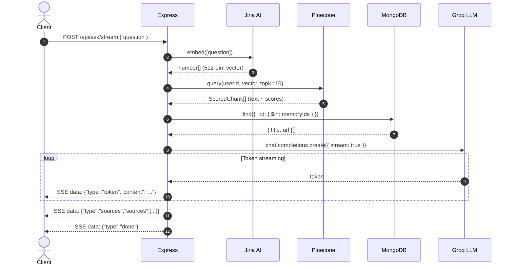

# Notable Memory CRUD + Q&A Pipeline (Stage 3)

This document explains the architectural decisions behind Stage 3 of Notable's backend. It covers the Memory CRUD API, the Retrieval-Augmented Generation (RAG) query pipeline, Server-Sent Events (SSE) streaming, and the Groq LLM integration — written with the rigor expected of a FAANG/YCombinator internal design review.

---

## 1. Stage 3 Overview

Stage 3 completes the API surface by adding:
- **Memory CRUD**: list (paginated), get, delete (with cascade), rescrape
- **Related memories**: find similar saved content via Pinecone vector similarity
- **Q&A service**: embed a question → query Pinecone → prompt Groq LLM → return answer with source citations
- **Two ask endpoints**: `POST /ask` (JSON) and `POST /ask/stream` (SSE)

```
                      ┌─────────────────────────────────────────────────────────┐
                      │                     Q&A Pipeline                       │
                      │                                                         │
  User Question ──►   │  embed(question) ──► Pinecone query ──► MongoDB lookup  │
                      │       │                    │                    │        │
                      │       │                    │                    │        │
                      │       ▼                    ▼                    ▼        │
                      │   question vector     scored chunks       titles/urls   │
                      │       │                    │                    │        │
                      │       └──────────────┬─────┘                    │        │
                      │                      ▼                         │        │
                      │              build LLM prompt ◄────────────────┘        │
                      │                      │                                  │
                      │                      ▼                                  │
                      │              Groq API (streaming) ──► SSE to client     │
                      └─────────────────────────────────────────────────────────┘
```



---

## 2. Engineering Decisions Under the Microscope

### 2.1 Why Two Ask Endpoints?

**Q:** *"You have `POST /ask` and `POST /ask/stream`. Why not just one streaming endpoint? The non-streaming caller can buffer the tokens."*

**A:** Three consumers, three needs:

1. **Frontend chat UI** → uses `/ask/stream`. Users expect a ChatGPT-like typing animation. SSE gives first-token latency of ~800ms — the answer begins appearing while the LLM is still generating. Buffering the entire response would mean 2-3 seconds of staring at a spinner.

2. **Chrome extension popup** → uses `/ask`. The extension's popup is a simple iframe. Implementing an SSE reader in a content script requires handling `ReadableStream`, backpressure, and cleanup on popup close. A simple `fetch → JSON.parse` is 5 lines of code vs. 30+ for SSE handling.

3. **cURL / API consumers** → uses `/ask`. Developers testing the API or building integrations want `curl -X POST /api/ask -d '{"question":"..."}' | jq .answer`. SSE output is not JSON — it's a multi-line event stream that requires parsing.

The implementation cost of maintaining both is minimal — the non-streaming `ask()` function is 40 lines, and the streaming `askStream()` generator shares the same embed → query → prompt logic but yields SSE events instead of returning a JSON object.

### 🧑‍💻 Beginner Code Walkthrough: The Non-Streaming Ask Controller

```typescript
// FILE: src/controllers/ask.controller.ts

import { ask } from '../services/qa.service.js';

export async function askHandler(req, res) {
  // req.body.question = "How do I install TypeScript?"
  // req.userId = the logged-in user's ID (set by auth middleware)
  const { question } = req.body;
  const userId = req.userId;

  // This single call does ALL the work:
  // 1. Embeds the question via Jina AI
  // 2. Searches Pinecone for similar chunks
  // 3. Looks up document titles from MongoDB
  // 4. Sends the context + question to Groq LLM
  // 5. Returns the generated answer + source citations
  const result = await ask(question, userId);

  // result looks like:
  // {
  //   answer: "TypeScript can be installed using npm install -g typescript...",
  //   sources: [
  //     { title: "TypeScript Handbook", url: "https://...", score: 0.92 },
  //     { title: "Getting Started with TS", url: "https://...", score: 0.87 },
  //   ]
  // }
  return res.status(200).json(result);
}
```

**What is `sources`?** It's a list of the user's saved articles that were relevant to the question. Each source has:
- `title` — the article's title (e.g., "TypeScript Handbook")
- `url` — the original URL the user saved
- `score` — how semantically similar that article was to the question (0 to 1)

The frontend can display these as clickable "References" under the answer, so the user can verify the AI's claims.

---

### 2.2 Server-Sent Events (SSE): Why Not WebSockets?

**Q:** *"WebSockets are bidirectional and more powerful. Why use SSE for streaming?"*

**A:** Four reasons:

| Feature | SSE | WebSocket |
|---|---|---|
| **Direction** | Server → Client only | Bidirectional |
| **Auto-reconnect** | Built into browser API | Must implement manually |
| **HTTP compatibility** | Works through all proxies, CDNs, load balancers | Requires upgrade handshake — breaks on some proxies |
| **Implementation complexity** | ~10 lines (set headers + write) | ~50 lines (lifecycle, heartbeat, error handling) |
| **Protocol** | Standard HTTP response | Separate protocol (ws://) |

Q&A streaming is **one-directional**: the server sends tokens to the client. The client never needs to send data mid-stream (it sends the question once via the POST body, then just listens). WebSockets' bidirectionality is wasted here, while its complexity is real.

**Auto-reconnect is crucial**: If the network hiccups mid-answer, the browser's `EventSource` API automatically reconnects and resumes. With WebSockets, you'd need to implement reconnection logic, track which tokens were already received, and handle partial state — significant engineering for a feature that SSE gives you for free.

**Proxy compatibility**: Many corporate proxies and CDNs (Cloudflare, AWS ALB) buffer WebSocket upgrade requests or drop idle connections. SSE flows over standard HTTP/1.1 or HTTP/2, so it passes through transparently.

### 🧑‍💻 Beginner Code Walkthrough: The SSE Streaming Controller

This is the controller that streams the answer word-by-word to the client:

```typescript
// FILE: src/controllers/ask.controller.ts

export async function askStreamHandler(req, res) {
  const { question } = req.body;
  const userId = req.userId;

  // STEP 1: Set the HTTP headers that tell the browser "this is an event stream"
  res.setHeader('Content-Type', 'text/event-stream');
  // ↑ This is the magic header. The browser sees this and knows:
  //   "Don't wait for the full response. Process each line as it arrives."

  res.setHeader('Cache-Control', 'no-cache');
  // ↑ Don't cache partial responses. Each stream is unique.

  res.setHeader('Connection', 'keep-alive');
  // ↑ Keep the TCP connection open — we'll send data over time.

  res.flushHeaders();
  // ↑ Send the headers NOW, before we have any body content.
  //   Without this, Express waits for the first res.write() call.

  // STEP 2: Loop through the stream events from the Q&A service
  for await (const event of askStream(question, userId)) {
    res.write(event);
    // Each `event` looks like:
    //   'data: {"type":"token","content":"The"}\n\n'
    //   'data: {"type":"token","content":" article"}\n\n'
    //   ...
    //   'data: {"type":"sources","sources":[...]}\n\n'
    //   'data: {"type":"done"}\n\n'
  }

  // STEP 3: End the HTTP response
  res.end();
}
```

**What does the client see?** A raw HTTP response that looks like this:

```
HTTP/1.1 200 OK
Content-Type: text/event-stream
Cache-Control: no-cache
Connection: keep-alive

data: {"type":"token","content":"Type"}

data: {"type":"token","content":"Script"}

data: {"type":"token","content":" can"}

data: {"type":"token","content":" be"}

data: {"type":"token","content":" installed"}

...

data: {"type":"sources","sources":[{"title":"TS Handbook","url":"https://...","score":0.92}]}

data: {"type":"done"}
```

Each `data:` line arrives as the LLM generates the next word. The browser receives them one-by-one and can display them instantly — no waiting for the full response.

**Error handling mid-stream**: If the Groq API fails after we've already started sending tokens, we can't return a `500` status code (headers are already sent). Instead, we send an error event:

```typescript
if (!res.headersSent) {
  return res.status(500).json({ error: 'Internal server error' });
}
// Headers already sent — can't change status code. Send error as an SSE event.
res.write(`data: ${JSON.stringify({ type: 'error', content: 'Internal server error' })}\n\n`);
res.end();
```

---

### 2.3 The Q&A Service: Step-by-Step Data Flow

**Q:** *"Walk me through every piece of data that moves through the Q&A pipeline."*

**A:** Let's trace a concrete question: `"How do I install TypeScript?"` asked by user `user_123`.

#### Step 1: Embed the Question

**What is sent**: The question string `"How do I install TypeScript?"` → Jina AI
```json
POST https://api.jina.ai/v1/embeddings
{
  "input": ["How do I install TypeScript?"],
  "model": "jina-embeddings-v4",
  "dimensions": 512,
  "task": "retrieval.passage"
}
```

**What is returned**: A single 512-dimensional vector
```typescript
const [questionVector] = await embed([question]);
// questionVector = [0.034, -0.112, 0.891, ..., 0.045]  (512 numbers)
```

**Why this works**: The question is now a point in 512-dimensional space. Points representing similar meanings are close together. `"How do I install TypeScript?"` will be close to chunks about TypeScript installation, npm commands, etc.

#### Step 2: Search Pinecone

**What is sent**: The question vector, the user's namespace, and `topK = 10`
```typescript
const matches = await query(userId, questionVector, 10);
```

Internally:
```typescript
await ns.query({
  vector: questionVector,    // [0.034, -0.112, ...]
  topK: 10,                  // Return 10 closest matches
  includeMetadata: true,     // Also return the saved chunk text
});
```

**What is returned**: An array of `ScoredChunk` objects:
```typescript
[
  {
    chunkId: "64a1f2abc_0",
    score: 0.92,              // Very relevant
    text: "TypeScript can be installed via npm...",
    memoryId: "64a1f2abc",    // Which saved article this came from
    chunkIndex: 0,
  },
  {
    chunkId: "4b3c8def_3",
    score: 0.87,
    text: "## Setup\nAfter installation, create a tsconfig.json...",
    memoryId: "4b3c8def",
    chunkIndex: 3,
  },
  // ... 8 more matches
]
```

**Key insight**: Pinecone returns both the similarity `score` AND the actual chunk `text` (from metadata). This eliminates a database call to fetch the chunk text — but we still need a MongoDB call in Step 3 to get the document `title` and `url` for source citations, since those aren't stored in Pinecone metadata. To eliminate MongoDB from the Q&A path entirely, we could store `title` and `url` in Pinecone metadata during upsert (trade-off: stale titles if the user edits them).

#### Step 3: Fetch Document Metadata from MongoDB

**What is sent**: The unique `memoryId`s from the Pinecone matches
```typescript
const memoryIds = [...new Set(matches.map((m) => m.memoryId))];
// memoryIds = ["64a1f2abc", "4b3c8def", ...]

const memories = await MemoryModel.find(
  { _id: { $in: memoryIds } },
  { title: 1, url: 1 }    // Only fetch title and url (projection)
).lean();
```

**What is returned**: Document metadata
```typescript
[
  { _id: "64a1f2abc", title: "TypeScript Handbook", url: "https://..." },
  { _id: "4b3c8def", title: "Getting Started with TS", url: "https://..." },
]
```

**Why this is necessary**: Pinecone stores chunk text and `memoryId`, but not the document title or URL. Those live in MongoDB's `MemoryModel`. This call maps `memoryId → { title, url }` so we can show the user which saved articles were used.

#### Step 4: Build the LLM Prompt

**What is sent to Groq**: A `messages` array with system prompt + user context
```typescript
const contextChunks = matches.slice(0, 5);  // Use top 5 for LLM context
const context = contextChunks
  .map((m) => `[Source: ${m.memoryId}]\n${m.text}`)
  .join('\n\n');
```

The actual prompt Groq sees:
```
System: You are a helpful assistant that answers questions based on
the user's saved content. Use the provided context to answer accurately.
If the context doesn't contain enough information, say so.
Always cite the source title when referencing information.

User: Context from saved content:

[Source: 64a1f2abc]
TypeScript can be installed via npm using the command
`npm install -g typescript`. Make sure you have Node.js installed first.

[Source: 4b3c8def]
## Setup
After installation, create a tsconfig.json file to configure your
TypeScript project settings...

[Source: 7e9a1b...]
For React projects, TypeScript comes pre-configured when using
`create-react-app --template typescript`...

Question: How do I install TypeScript?
```

#### Step 5: Stream the Answer

**Non-streaming** (`POST /ask`):
```typescript
const completion = await groq.chat.completions.create({
  model: GROQ_MODEL,           // 'llama-3.3-70b-versatile'
  messages: [systemPrompt, userPrompt],
  temperature: 0.3,             // Low = factual, not creative
});
const answer = completion.choices[0]?.message?.content;
return { answer, sources };
```

**Streaming** (`POST /ask/stream`):
```typescript
const stream = await groq.chat.completions.create({
  model: GROQ_MODEL,
  messages: [systemPrompt, userPrompt],
  temperature: 0.3,
  stream: true,                 // ← This changes everything
});

for await (const chunk of stream) {
  const token = chunk.choices[0]?.delta?.content;
  if (token) {
    yield `data: ${JSON.stringify({ type: 'token', content: token })}\n\n`;
  }
}
// After all tokens:
yield `data: ${JSON.stringify({ type: 'sources', sources })}\n\n`;
yield `data: ${JSON.stringify({ type: 'done' })}\n\n`;
```

**The difference between `stream: false` and `stream: true`**:
- Without streaming: Groq generates the entire answer (~200 tokens, ~1.5s), then sends it all at once. The client waits 2.3 seconds before seeing anything.
- With streaming: Groq sends each token as it's generated. The client sees the first word within ~800ms, and the rest appears word-by-word over the next 1.5 seconds.

---

### 2.4 Why `temperature: 0.3`?

**Q:** *"ChatGPT uses temperature 1.0 by default. Why did you choose 0.3?"*

**A:** Temperature controls randomness in the LLM's output:

| Temperature | Behavior | Use Case |
|---|---|---|
| **0.0** | Deterministic — always picks the most probable token | Code generation, math |
| **0.3** | Low randomness — factual, sticks close to the context | RAG Q&A, summarization |
| **0.7** | Moderate randomness — balanced creativity | General conversation |
| **1.0** | High randomness — creative, diverse outputs | Creative writing, brainstorming |

For RAG Q&A, the answer should be **grounded in the retrieved context**, not creatively invented. A temperature of 0.3 means:
- The model strongly prefers tokens that logically follow from the context chunks
- It won't "hallucinate" information not present in the chunks
- It still has enough flexibility to paraphrase and synthesize across multiple chunks

If we set temperature to 0.0, the model would sometimes produce stiff, repetitive answers. At 1.0, it would occasionally ignore the context and generate plausible-sounding but incorrect answers (hallucination).

---

### 2.5 Why Groq? Not OpenAI, Anthropic, or Local LLM?

**Q:** *"Groq is relatively new. Why not use GPT-4, Claude, or run a local model?"*

**A:** Selection criteria (in priority order for an MVP):

1. **Speed**: Groq runs LLMs on custom LPU (Language Processing Unit) hardware. Llama 3.3 70B on Groq generates ~300 tokens/second vs. ~50 tokens/second on GPT-4 via OpenAI. For streaming Q&A, this means the answer completes in ~0.7s vs. ~4s. The speed difference is viscerally noticeable.

2. **Cost**: Groq's free tier includes generous rate limits for development. Llama 3.3 70B on Groq costs $0.59/M input tokens + $0.79/M output tokens. GPT-4 Turbo costs $10/M input + $30/M output — 17× more expensive. Claude 3.5 Sonnet costs $3/M input + $15/M output — 5× more expensive.

3. **Model configurability**: The `GROQ_MODEL` env var means switching from `llama-3.3-70b-versatile` to a different model (Mixtral, Gemma, or a future release) requires zero code changes. If Groq adds GPT-4 to their platform, we can switch with a single env var change.

4. **Open-weight model**: Llama 3.3 70B is an open-weight model by Meta. If Groq goes down, we can host the same model on Together.ai, Fireworks.ai, or even self-host it on a GPU. With OpenAI, the model is proprietary — if their API goes down, there's no fallback.

**Vendor lock-in risk**: The Groq integration is a 60-line file (`qa.service.ts`). It uses the `groq-sdk` which is API-compatible with the OpenAI SDK (same interface). Switching to OpenAI literally requires `new OpenAI()` instead of `new Groq()` and changing the model name.

---

## 3. Memory CRUD: Design Decisions

### 3.1 Paginated List

**Q:** *"Why pagination? Just return all memories."*

**A:** A user who has saved 5,000 articles generates a 5,000-document JSON array — roughly 2-5MB of data. Transferring this over a mobile connection takes 3-10 seconds. Rendering 5,000 DOM nodes in a browser freezes the UI for 500ms+. Pagination limits each response to a manageable chunk (default: 20 items, max: 100).

```typescript
// FILE: src/controllers/memory.controller.ts

export async function list(req, res) {
  const userId = req.userId;

  // Parse pagination params from query string
  // GET /api/memories?page=2&limit=20
  const page = Math.max(1, parseInt(req.query.page) || 1);
  const limit = Math.min(100, Math.max(1, parseInt(req.query.limit) || 20));
  const skip = (page - 1) * limit;

  // Two queries in parallel:
  // 1. Fetch this page's memories (sorted newest-first)
  // 2. Count total memories (for "Page 2 of 15" display)
  const [memories, total] = await Promise.all([
    MemoryModel.find({ userId })
      .sort({ createdAt: -1 })   // Newest first
      .skip(skip)                 // Skip previous pages
      .limit(limit)               // Only fetch this page
      .lean(),                    // Return plain objects (not Mongoose docs)
    MemoryModel.countDocuments({ userId }),
  ]);

  return res.status(200).json({
    memories,
    page,
    limit,
    total,
    totalPages: Math.ceil(total / limit),
  });
}
```

**Why `Promise.all`?** The two MongoDB queries (`find` and `countDocuments`) are independent — they don't depend on each other's result. Running them in parallel saves ~5ms vs. sequential execution. At scale, this compounds.

**Why `.lean()`?** Mongoose `find()` returns full Mongoose document objects with methods like `.save()`, `.validate()`, change tracking, etc. For a read-only list endpoint, we don't need any of that. `.lean()` returns plain JavaScript objects — ~3× faster and uses ~50% less memory.

**Why `Math.min(100, ...)`?** Without a max limit, a malicious or buggy client could request `?limit=999999` and force MongoDB to load the entire collection into memory. Capping at 100 prevents this.

---

### 3.2 Delete Cascade

**Q:** *"You delete from Pinecone, MongoDB chunks, and the Memory document. What if one of these fails halfway?"*

**A:** The delete operation touches three stores in sequence:

```typescript
export async function deleteMemory(req, res) {
  const id = req.params.id;
  const userId = req.userId;

  // 1. Verify the memory exists and belongs to this user
  const memory = await MemoryModel.findOne({ _id: id, userId });
  if (!memory) {
    return res.status(404).json({ error: 'Memory not found' });
  }

  // 2. Delete vectors from Pinecone + chunks from MongoDB
  await deleteByMemory(userId, id);

  // 3. Delete the memory document itself
  await MemoryModel.deleteOne({ _id: id });

  return res.status(200).json({ message: 'Memory deleted' });
}
```

The `deleteByMemory` function in `vector-store.service.ts`:

```typescript
export async function deleteByMemory(userId, memoryId) {
  const ns = getIndex().namespace(userId);

  // Get all chunk IDs from MongoDB (we know exactly which vectors to delete)
  const chunks = await ChunkModel.find({ memoryId }, { chunkIndex: 1 }).lean();
  const ids = chunks.map((c) => `${memoryId}_${c.chunkIndex}`);

  // Delete from Pinecone
  if (ids.length > 0) {
    await ns.deleteMany({ ids });
  }

  // Delete chunk documents from MongoDB
  await ChunkModel.deleteMany({ memoryId });
}
```

**Failure scenarios and their consequences:**

| Fails At | State | Consequence | Recovery |
|---|---|---|---|
| After Pinecone delete, before ChunkModel delete | Vectors gone, chunks remain in MongoDB, memory document remains | Orphaned chunk docs in MongoDB | Harmless — chunks have no effect without vectors. Next delete attempt cleans up. |
| After ChunkModel delete, before MemoryModel delete | Vectors gone, chunks gone, memory document remains with `chunkCount > 0` | Ghost memory with no content | User can retry delete. Or rescrape would rebuild it. |
| After everything | Clean state | ✅ | N/A |

**Why not use a transaction?** MongoDB transactions require a replica set, and Pinecone has no transaction support. There's no way to atomically delete across two different databases. The sequential delete order is designed so that partial failures leave the system in a recoverable state — orphaned data is harmless and can be cleaned up by retrying or by a periodic cleanup job (not implemented yet, but trivial to add).

---

### 3.3 Rescrape: Why Not Just Delete + Create?

**Q:** *"To rescrape, you could delete the memory and have the user save the URL again. Why build a dedicated rescrape endpoint?"*

**A:** Three reasons:

1. **Preserve the memory ID**: Other parts of the system (collections, tags, bookmarks) may reference this memory by its `_id`. Delete + re-create generates a new `_id`, breaking those references. Rescrape keeps the same `_id`.

2. **Preserve user metadata**: Tags, collections, and any user-added notes are stored on the memory document. Delete destroys them. Rescrape only clears the content-derived fields (`chunkCount`, `status`) and re-runs the pipeline.

3. **UX simplicity**: "Rescrape" is one click. "Delete, then re-save the URL" is three clicks plus remembering/copying the URL.

```typescript
export async function rescrape(req, res) {
  const id = req.params.id;
  const userId = req.userId;

  const memory = await MemoryModel.findOne({ _id: id, userId });
  if (!memory) {
    return res.status(404).json({ error: 'Memory not found' });
  }

  // Extension-sourced memories can't be rescrapped — we don't have the URL to scrape
  if (memory.source === 'extension') {
    return res.status(400).json({
      error: 'Cannot rescrape extension-sourced memories.'
    });
  }

  // 1. Delete old vectors and chunks
  await deleteByMemory(userId, id);

  // 2. Reset the memory to "pending" state
  await MemoryModel.findByIdAndUpdate(id, {
    status: 'pending',
    chunkCount: 0,
    errorMessage: null,
  });

  // 3. Re-queue the same URL for processing
  await memoryQueue.add(`memory-rescrape-${id}`, {
    memoryId: id,
    userId,
    mode: 'url',
    url: memory.url,  // Use the ORIGINAL saved URL
  });

  return res.status(202).json({ memory: { _id: id, status: 'pending' } });
}
```

**Why block extension rescrape?** Extension-sourced memories were created by the Chrome extension sending pre-extracted content (HTML text, not a URL). The server never scraped a URL for these — it doesn't know how to "re-scrape" content that came from the user's browser. The user would need to visit the page in their browser and re-save it via the extension.

---

### 3.4 Related Memories: How Similarity Search Works

**Q:** *"How does 'related memories' work? The user didn't ask a question — they're viewing a saved article."*

**A:** Instead of embedding a question, we use the article's own first chunk vector as the search query. The idea: "find me articles whose content is similar to this article."

```typescript
export async function getRelated(req, res) {
  const id = req.params.id;
  const userId = req.userId;

  // 1. Verify the memory exists
  const memory = await MemoryModel.findOne({ _id: id, userId });
  if (!memory) {
    return res.status(404).json({ error: 'Memory not found' });
  }

  // 2. querySimilar uses the memory's own vector as the search query
  const matches = await querySimilar(userId, id, 10);

  // 3. Deduplicate and exclude the memory itself
  const seen = new Set();
  const relatedMemories = [];
  for (const match of matches) {
    if (!seen.has(match.memoryId) && match.memoryId !== id) {
      seen.add(match.memoryId);
      const relMemory = await MemoryModel.findById(match.memoryId, {
        title: 1, url: 1, description: 1,
      }).lean();
      if (relMemory) {
        relatedMemories.push({
          _id: relMemory._id,
          title: relMemory.title,
          url: relMemory.url,
          description: relMemory.description,
          score: match.score,
        });
      }
    }
  }

  return res.status(200).json({ memories: relatedMemories });
}
```

**How `querySimilar` works internally** (in `vector-store.service.ts`):

```typescript
export async function querySimilar(userId, memoryId, topK = 5) {
  const ns = getIndex().namespace(userId);

  // Fetch the first chunk's vector for this memory
  const firstChunkId = `${memoryId}_0`;
  const fetchResult = await ns.fetch({ ids: [firstChunkId] });
  const record = fetchResult.records?.[firstChunkId];

  if (!record?.values) {
    return [];  // No vector found — memory might still be processing
  }

  // Use that vector as the search query
  return query(userId, record.values, topK);
}
```

**Why the first chunk?** The first chunk of a document typically contains the title, introduction, and thesis — the most representative summary of the content. Using all chunks would require averaging their vectors, which dilutes the signal. Using just the first chunk is a simple heuristic that works well in practice.

**Alternative: centroid approach** — compute the average of all chunk vectors for a memory and use that as the query. This would require storing the centroid as a separate vector or computing it on the fly. For MVP, the first-chunk heuristic is sufficient.

---

## 4. Failure Mode Analysis

### 4.1 Groq API Failures

| Error | Cause | Handling |
|---|---|---|
| **Rate limit (429)** | Too many requests per minute | Groq SDK handles this internally with retries. If exhausted, the error bubbles up to the controller. |
| **Timeout** | Groq is slow or overloaded | The `groq.chat.completions.create()` call has a default timeout. SSE controller sends an error event. |
| **Model unavailable** | Model is being updated | Returns 500. The `GROQ_MODEL` env var lets us switch to a different model instantly. |
| **Context too long** | Too many chunks stuffed into the prompt | We limit to 5 chunks × 500 tokens = ~2500 tokens of context. Llama 3.3 70B has a 128K token context window. Not a risk. |

### 4.2 What If Pinecone Returns Zero Matches?

This happens when:
- The user has no saved content
- The question is completely unrelated to any saved content
- The user's vectors were deleted (account cleanup, Pinecone issue)

The service handles this gracefully:

```typescript
if (matches.length === 0) {
  return {
    answer: 'I could not find any relevant information in your saved content.',
    sources: [],
  };
}
```

For the streaming endpoint, it sends the "no results" message as a token event (so the UI still works) and immediately sends `done`:

```typescript
if (matches.length === 0) {
  yield `data: ${JSON.stringify({
    type: 'token',
    content: 'I could not find any relevant information...'
  })}\n\n`;
}
// Sources and done are always sent, even with zero matches
yield `data: ${JSON.stringify({ type: 'sources', sources })}\n\n`;
yield `data: ${JSON.stringify({ type: 'done' })}\n\n`;
```

### 4.3 SSE Connection Drops

If the client disconnects mid-stream (closes the tab, loses network), the server is still writing to the response object. Node.js/Express handles this gracefully — `res.write()` on a closed connection is a no-op (it doesn't throw). The `for await` loop completes, `res.end()` is called, and the resources are cleaned up normally.

For long-running streams, there's no heartbeat mechanism yet. If the connection is idle for too long (e.g., Groq is slow to respond), a proxy might close it. In production, you'd add periodic `:\n\n` SSE comments as keep-alive pings:

```typescript
// Not implemented yet, but would look like:
const heartbeat = setInterval(() => res.write(':\n\n'), 15000);
// ... streaming logic ...
clearInterval(heartbeat);
```

---

## 5. Interview-Style Q&A

### Why does the SSE stream send `sources` after tokens (not before)?

The spec defines the event order as: `token` → `token` → ... → `sources` → `done`. This is intentional:

- **UX-first**: The user sees the answer streaming in immediately (~800ms first token). If sources appeared first, the user would stare at source titles for 500ms before the first word of the answer appears, creating the perception of slowness.
- **Implementation simplicity**: Sources are pre-computed (from the Pinecone query, resolved before the LLM call starts). We buffer them and append after the token stream finishes.
- **SSE spec compliance**: The `done` event signals termination — the client knows it can stop listening.

### Why use `.lean()` on MongoDB queries?

Mongoose `find()` returns full Mongoose document instances — objects with methods like `.save()`, `.validate()`, getters/setters, and change tracking. For read-only endpoints (list, get, related), none of these are needed. `.lean()` returns plain JavaScript objects:

- ~3× faster document hydration (no prototype chain setup)
- ~50% less memory per document (no internal state tracking)
- JSON serialization is faster (no virtual fields to compute)

In a list endpoint returning 20-100 documents, the cumulative effect is significant.

### What happens if the same question is asked twice?

Nothing special — there's no caching. Each question goes through the full pipeline: embed → search → LLM. This is by design:

1. The user's saved content may have changed between questions (new articles saved, old ones deleted). A cached answer might reference deleted content.
2. LLM responses are non-deterministic (even at temperature 0.3, there's slight variation). The "same" question might get a slightly different answer, which is acceptable.
3. Adding a cache requires a cache invalidation strategy (when to expire? when content changes? per-user?). The complexity isn't justified at MVP scale.

If latency becomes a problem, the first optimization would be embedding caching (skip the Jina API call for repeated questions), not answer caching.

### Why does `getRelated` make N+1 database queries?

The current implementation queries MongoDB for each related memory individually inside a loop:

```typescript
for (const match of matches) {
  const relMemory = await MemoryModel.findById(match.memoryId, ...).lean();
  // ...
}
```

This is an N+1 query pattern — for 10 matches, it makes 10 separate MongoDB queries. The correct approach would be a single batch query:

```typescript
const memoryIds = [...new Set(matches.map((m) => m.memoryId))];
const memories = await MemoryModel.find({ _id: { $in: memoryIds } }).lean();
```

This is a known optimization opportunity. At current scale (max 10 related memories per request), the N+1 pattern adds ~50ms total — noticeable but not critical. The batch approach would reduce it to ~5ms. This should be fixed when the endpoint sees higher traffic.

### Why is `querySimilar` not used for Q&A?

`querySimilar` uses a memory's first chunk vector as the search query. For Q&A, we embed the user's question instead. The difference:

- **querySimilar**: "Find articles similar to *this article*" — document-to-document similarity
- **Q&A query**: "Find chunks relevant to *this question*" — question-to-document similarity

These are fundamentally different operations. A question like "How do I install TypeScript?" is much shorter and more targeted than an article's first paragraph. The question embedding captures the user's intent; the article embedding captures the document's topic. Using the wrong embedding type would produce lower-quality results.

---

## 6. Alternative Approaches

### 6.1 WebSocket Instead of SSE

**Rejected.** See section 2.2. SSE is simpler, auto-reconnects, and works through all proxies. WebSockets add operational complexity for a use case that is strictly unidirectional.

### 6.2 Cursor-Based Pagination Instead of Offset

**Considered.** Offset pagination (`skip(20).limit(20)`) has a known performance problem: for page 500, MongoDB must skip 10,000 documents. Cursor-based pagination (using `createdAt` as the cursor) is O(1) per page.

**Why we kept offset:** The frontend needs to display "Page X of Y" and allow jumping to any page. Cursor-based pagination only supports next/previous — you can't jump to page 50 directly. At current scale (<10K memories per user), offset pagination performance is acceptable (~5ms for page 100).

**Migration path:** If a user accumulates 100K+ memories, switch to cursor-based pagination with a `lastId` parameter instead of `page`. This requires frontend changes (infinite scroll instead of page numbers).

### 6.3 Redis Caching for Q&A Results

**Rejected.** Caching Q&A answers in Redis (keyed by question hash + userId) would eliminate repeat embed + search + LLM calls.

**Why not:** Cache invalidation is unsolvable without tracking exactly which chunks are referenced by each cached answer. When a user saves or deletes a memory, all cached answers that referenced that memory's chunks would need to be invalidated. This requires a reverse index (answer → chunks → memories), which is as complex as the Q&A pipeline itself.

### 6.4 Streaming Directly from Groq's Response (No AsyncGenerator)

**Considered.** Instead of the `askStream()` AsyncGenerator pattern, we could pipe Groq's response stream directly to the Express response:

```typescript
// Alternative: direct pipe
const stream = await groq.chat.completions.create({ stream: true, ... });
for await (const chunk of stream) {
  res.write(`data: ${JSON.stringify({ type: 'token', content: chunk.choices[0]?.delta?.content })}\n\n`);
}
```

**Why we chose AsyncGenerator:** The generator pattern (`yield` in `qa.service.ts`) separates concerns:
- The **service** knows how to query and format events
- The **controller** knows how to set HTTP headers and handle errors

If we piped directly, the service would need access to the Express `res` object — violating the service/controller separation. The generator is testable in isolation (you can iterate it without an HTTP server), while the direct pipe approach requires an Express mock for testing.
