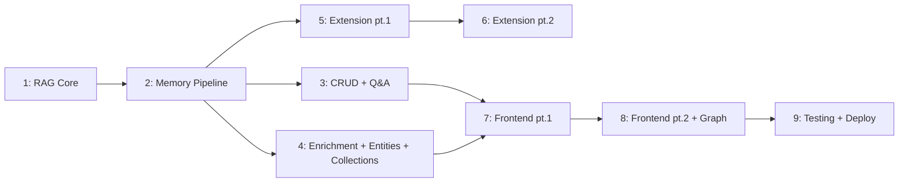

# Notable — Spec Index

All remaining work split into **9 stages**. Most are ~3 days, two are ~4 days (Stages 4 and 8 carry the entity extraction + knowledge graph features).
Stages 3, 4, 5 can run in parallel once Stage 2 is done.

## What's Already Built (Days 1–5)

Auth (better-auth), scraper (10+ extractors), middleware (rate limit, validation, auth guard), Express app, Docker Compose, logger, tests.

---

## Stages

| # | Spec | What's built | Effort |
|---|---|---|---|
| 1 | [stage-1.md](./stage-1.md) | Chunker + Embedding + Vector store + Chunk model | ~3 days |
| 2 | [stage-2.md](./stage-2.md) | Memory model + BullMQ/Redis + async creation pipeline | ~3 days |
| 3 | [stage-3.md](./stage-3.md) | Memory CRUD + Q&A with SSE streaming | ~3 days |
| 4 | [stage-4.md](./stage-4.md) | Enrichment + Entity extraction + Collections + Search + Export | **~4 days** |
| 5 | [stage-5.md](./stage-5.md) | Extension: scaffold + content extraction + real site testing | ~3 days |
| 6 | [stage-6.md](./stage-6.md) | Extension: API integration + auth + bookmark listener + popup | ~3 days |
| 7 | [stage-7.md](./stage-7.md) | Frontend: React setup + auth + dashboard + save URL | ~3 days |
| 8 | [stage-8.md](./stage-8.md) | Frontend: Chat Q&A + knowledge graph (D3.js) + collections + export + polish | **~4 days** |
| 9 | [stage-9.md](./stage-9.md) | Integration testing + deploy + README | ~2 days |
| — | [future.md](./future.md) | Post-launch: public collections, webhook export, etc. | — |

**Total: ~28 days remaining.**

---

## What moved into core (was in future.md)

- ✅ **Entity extraction** with deduplication + co-occurrence graph → Stage 4
- ✅ **Knowledge graph visualization** (D3.js) → Stage 8
- ✅ **Markdown export** (backend endpoints in Stage 4, frontend buttons in Stage 8)

## Conventions

- **`[EXISTING]`** — already built, listed for context
- **`[NEW]`** — to be created in this stage
- Each spec has: **Goal**, **Scope** (in/out), **Key Decisions**, **Files**, and **Done When**
