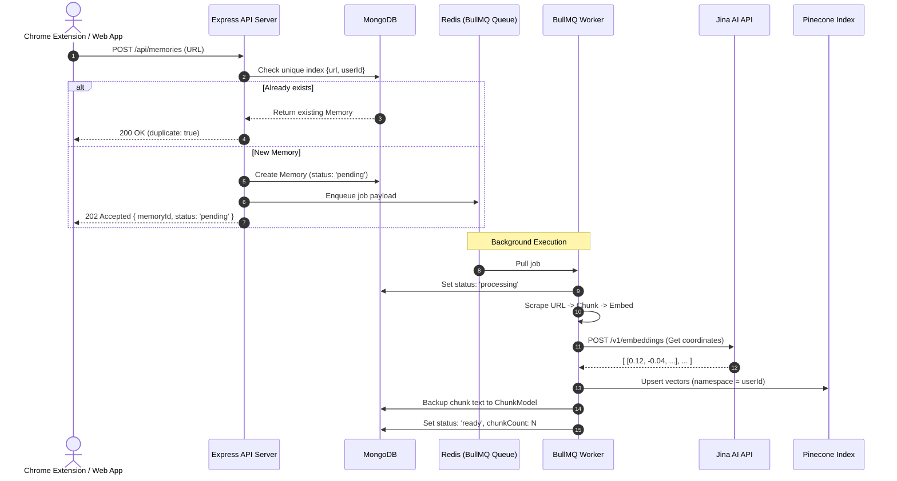

# Notable Ingestion & Processing Pipeline (Stage 1 & 2)

This guide walks you through how **Notable** saves web content and processes it for AI search. It is written assuming you are new to AI search concepts like **RAG**, **embeddings**, **chunking**, and **vector databases**.

---

## 1. Core Concepts Explained

Before looking at the code, let's understand the core concepts.

### What is RAG (Retrieval-Augmented Generation)?
An AI model (like ChatGPT, Claude, or Groq) is trained on general knowledge. It doesn't know about *your* personal bookmarks, a private Slack channel, or a specific blog post you read yesterday.
Instead of sending a massive document to the AI every time you ask a question (which is slow and expensive), we use **RAG**:
1. **Retrieve**: When you ask a question, we search our database for the most relevant *paragraphs* of the articles you've saved.
2. **Augment**: We insert those paragraphs into a prompt (e.g. *"Answer this question using only this context: [Paragraphs]"*).
3. **Generate**: We send this combined prompt to the AI, which generates a precise answer based on your saved articles.

### What is Chunking?
You can't embed an entire book or a 20-page article as a single entry. If you do, the specific details get lost in the noise, and it exceeds the maximum input limits of embedding models.
**Chunking** is the process of breaking a long document into smaller, coherent pieces (typically ~500 words or tokens) with slight overlaps so that meaning isn't cut off at the boundaries.

### What is an Embedding?
An embedding model converts text into a list of numbers (a coordinate vector, e.g., `[0.12, -0.05, 0.91, ...]`). 
* Similar texts (e.g., *"How do I install TypeScript?"* and *"Setup guide for TypeScript"*) will have coordinates that are very close to each other in mathematical space.
* Unrelated texts (e.g., *"The cat sat on the mat"*) will have coordinates far away.
By comparing these lists of numbers (using math like *Cosine Similarity*), we can find semantically related content instantly without relying on simple keyword matching.

### What is a Vector Database?
Traditional databases (like MongoDB or SQL) search by matching exact fields. A **Vector Database** (like Pinecone) is designed specifically to index and search coordinates (embeddings) at lighting speed. It tells you which saved paragraphs are closest to your search query.

---

## 2. System Architecture

The workflow is split into two halves:
1. **API Ingestion (Stage 2)**: Accepts the request, checks for duplicates, saves a placeholder in MongoDB, enqueues the job to Redis, and returns `202 Accepted` to the user immediately.
2. **Asynchronous Worker (Stage 1 & 2)**: Runs in the background, pulls jobs from the queue, scrapes pages, chunks the text, embeds it via Jina AI, and stores it in Pinecone.



---

## 3. Detailed Code Walkthrough

### Part A: The Async Queue Ingestion (`src/controllers/memory.controller.ts`)
When a user submits a URL, we do not make them wait for scraping and embedding. We check if they saved it before, insert a document, throw a job in Redis, and respond.

Here is the controller logic for `POST /api/memories`:

```typescript
export async function createFromUrl(req: AuthenticatedRequest, res: Response) {
  const { url } = req.body;
  const userId = req.userId!;

  // 1. Check if the user already saved this URL
  const existing = await MemoryModel.findOne({ url, userId });
  if (existing) {
    return res.status(200).json({ memory: existing, duplicate: true });
  }

  let memory;
  try {
    // 2. Insert document as 'pending'
    memory = await MemoryModel.create({
      url,
      userId,
      status: 'pending',
      source: 'url',
      contentType: 'generic',
    });
  } catch (err: any) {
    // Handle race conditions: if two requests come at the exact same millisecond,
    // MongoDB unique index will throw E11000. We catch it and return the duplicate.
    if (err.code === 11000) {
      const duplicate = await MemoryModel.findOne({ url, userId });
      if (duplicate) {
        return res.status(200).json({ memory: duplicate, duplicate: true });
      }
    }
    throw err;
  }

  // 3. Queue the background processing job in Redis
  await memoryQueue.add(`memory-url-${memory._id}`, {
    memoryId: memory._id.toString(),
    userId,
    mode: 'url',
    url,
  });

  // 4. Return immediately to the user
  return res.status(202).json({ memory });
}
```

---

### Part B: The Chunker Service (`src/services/chunker.service.ts`)
Once the worker picks up the job, it scrapes the page and chunks the clean text. We use a **3-bucket strategy** to preserve the structure of the document:

```typescript
export async function chunk(text: string, contentType: ContentType): Promise<Chunk[]> {
  const totalTokens = tokenLen(text);

  // BUCKET 1: Short content - Do not split to preserve atomic meaning
  if (totalTokens <= CHUNK_SIZE) {
    return [{ text, index: 0 }];
  }

  // BUCKET 2: Structured Content (Articles, GitHub, HN, Wikipedia)
  if (['article', 'reddit', 'github', 'stackoverflow', 'wikipedia', 'hn'].includes(contentType)) {
    return splitByHeaders(text);
  }

  // BUCKET 3: Unstructured Content (YouTube transcripts, logs, generic)
  return splitBySentences(text);
}
```

#### The Header Anchor Splitting Code:
In markdown documents, we split by headings (`##`, `###`). If a section is too long, we split it into smaller paragraphs, but we **prepend** the nearest heading to each chunk so the context isn't lost.

```typescript
async function splitByHeaders(text: string): Promise<Chunk[]> {
  // First pass: Split by headers
  const headerDocs = await markdownSplitter.createDocuments([text]);
  const finalChunks: string[] = [];

  for (const doc of headerDocs) {
    const content = doc.pageContent;
    // Extract nearest markdown heading from this chunk
    const headerMatch = content.match(/^(#{1,6}\s+.*)$/m);
    const header = headerMatch ? headerMatch[1].trim() : '';

    if (tokenLen(content) > CHUNK_SIZE) {
      // Sub-split long sections recursively by paragraphs
      const subDocs = await paragraphSplitter.createDocuments([content]);
      for (const sub of subDocs) {
        const subContent = sub.pageContent;
        // Prepend the heading prefix to each sub-chunk
        const chunkText = (header && !subContent.startsWith(header))
          ? `${header}\n${subContent}`
          : subContent;
        finalChunks.push(chunkText);
      }
    } else {
      finalChunks.push(content);
    }
  }

  return finalChunks.map((text, index) => ({ text, index }));
}
```

---

### Part C: The Embedding Service (`src/services/embedding.service.ts`)
Next, we take the chunked texts and send them to Jina AI to generate mathematical vectors.

```typescript
async function embedBatch(texts: string[]): Promise<number[][]> {
  const apiKey = process.env.JINA_API_KEY;
  if (!apiKey) throw new EmbeddingError('JINA_API_KEY is not set');

  let attempt = 0;
  while (attempt <= MAX_RETRIES) {
    try {
      const response = await axios.post(
        'https://api.jina.ai/v1/embeddings',
        {
          input: texts,
          model: 'jina-embeddings-v4',
          dimensions: 512, // Matryoshka learning: tells Jina to output 512 numbers instead of 2048
          task: 'retrieval.passage',
        },
        {
          headers: { Authorization: `Bearer ${apiKey}` },
          timeout: 30000,
        }
      );
      return response.data.data.map((d: any) => d.embedding);
    } catch (err) {
      // Handle rate limits (429) using exponential backoff
      if ((err as AxiosError).response?.status === 429 && attempt < MAX_RETRIES) {
        const delay = Math.round(Math.pow(2, attempt) * 1000);
        await sleep(delay);
        attempt++;
        continue;
      }
      throw err;
    }
  }
  throw new Error('Max retries exceeded');
}
```

---

### Part D: The Vector Store Service (`src/services/vector-store.service.ts`)
Now we store the Jina coordinates in Pinecone, and write a copy of the plain text to MongoDB.

```typescript
export async function upsertChunks(
  userId: string,
  memoryId: mongoose.Types.ObjectId,
  chunks: Chunk[],
  vectors: number[][]
): Promise<void> {
  const memoryIdStr = memoryId.toString();
  const index = getIndex();
  // Isolate users by placing vectors inside namespaces
  const ns = index.namespace(userId);

  // 1. Prepare Pinecone Records
  const records = chunks.map((c, i) => ({
    id: `${memoryIdStr}_${c.index}`, // Deterministic vector ID
    values: vectors[i],             // Coordinating numbers (embedding)
    metadata: {
      memoryId: memoryIdStr,
      chunkIndex: c.index,
      userId,
      chunkText: c.text,            // Save copy of text inside Pinecone for faster Q&A retrieval
    },
  }));

  // 2. Write to Pinecone
  await ns.upsert({ records });

  // 3. Write copy to MongoDB ChunkModel for backups
  await ChunkModel.deleteMany({ memoryId });
  await ChunkModel.insertMany(
    chunks.map((c) => ({
      memoryId,
      userId,
      chunkIndex: c.index,
      text: c.text,
    }))
  );
}
```

---

### Part E: Querying Chunks (How Retrieval Works)
When a user asks a question, we embed the question and ask Pinecone to return the nearest vectors.

```typescript
export async function query(
  userId: string,
  vector: number[],
  topK = 5
): Promise<ScoredChunk[]> {
  const index = getIndex();
  const ns = index.namespace(userId);

  // Query Pinecone for vectors matching the question's coordinates
  const result = await ns.query({
    vector,
    topK,
    includeMetadata: true, // Asks Pinecone to return the chunkText saved with the vector
  });

  return (result.matches ?? []).map((m) => {
    const { memoryId, chunkIndex } = parseVectorId(m.id);
    return {
      chunkId: m.id,
      score: m.score ?? 0,               // Relevance score (closer to 1 = more relevant)
      text: (m.metadata?.chunkText as string) ?? '',
      memoryId,
      chunkIndex,
    };
  });
}
```

---

## 4. How It Works End-to-End

Let's trace what happens when you save an article called *"How to learn TypeScript"* with URL `https://example.com/ts`:

1. **API Ingestion**:
   * You click save. Your client makes a request to `POST /api/memories`.
   * The controller verifies you haven't saved `https://example.com/ts` before.
   * It creates a record in MongoDB: `{ url: 'https://example.com/ts', status: 'pending', userId: 'user_123' }`.
   * It enqueues a job payload: `{ memoryId: 'mem_abc', mode: 'url', url: '...' }` into Redis.
   * Your client receives a `202 Accepted` response.

2. **Background Processing**:
   * The worker pulls the job from Redis.
   * The worker scrapes `https://example.com/ts` and gets the text content.
   * The text is chunked into 3 paragraphs (since it's a long article).
   * The 3 paragraph chunks are sent to Jina AI, which returns 3 arrays of numbers (e.g. `[0.05, -0.12, ...]`, size 512).
   * These vectors are saved in Pinecone under the namespace `user_123`.
   * The plain texts are saved in MongoDB `chunks` collection.
   * The memory status in MongoDB is updated to `'ready'`.

3. **Asking a Question (Stage 3 Preview)**:
   * You search: *"Where do I start with TypeScript?"*
   * Your question is converted into an embedding vector by Jina AI.
   * We query Pinecone namespace `user_123` with this vector.
   * Pinecone returns the 3 most similar chunks from *"How to learn TypeScript"*.
   * We pass those 3 chunks + your question to Groq (LLM).
   * Groq streams the final answer back to your screen.

---

## 5. Chunking Deep Dive: An Interview-Style Examination

To truly understand our design, let’s run through an aggressive technical interview ("grilling") on the mechanics and strategies of chunking in a RAG pipeline.

### Q1: Why don't we just generate an embedding for the entire document as a single vector? It would save Pinecone storage and database complexity.
**Interviewer:** *"If a user saves a 10-page article, why not just get one single embedding vector for the whole article?"*

**Developer:**
"That fails due to a concept called **vector dilution**. 
An embedding vector is a fixed-size array of numbers (in our case, 512 numbers). Each number represents a coordinate in a multi-dimensional semantic space. 

If you compress a 10-page document containing installation guides, code snippets, author bios, and pricing history into a single vector, the coordinates will gravitate towards the mathematical average of all those topics. You get a 'noisy middle' vector. 

When the user queries later: *'How do I run npm install?'*, the semantic vector for that query will search Pinecone. It will completely miss your 10-page document because the specific installation commands were mathematically diluted by the other 9 pages of text. By chunking, we create focused, high-density vector records for each topic, ensuring precise matches."

---

### Q2: Why not just split the text every 1,000 characters? It's simple, requires zero dependencies, and executes in $O(1)$ time.
**Interviewer:** *"You installed `@langchain/textsplitters` and imported `js-tiktoken`. That's package bloat. Why not just write `text.slice(0, 1000)` in a loop?"*

**Developer:**
"Naively slicing characters leads to two critical problems:
1. **Broken semantic units**: Slicing exactly at 1,000 characters cuts words in half (e.g. `TypeS` on one chunk, `cript` on the next) and breaks sentences mid-thought. The embedding model has no idea what `TypeS` means.
2. **Character $\neq$ Token**: Language models and embedding models don't read characters; they read **tokens** (sub-word fragments). A 1,000-character block of simple English might be 200 tokens. A 1,000-character block of code or math notation might be 800 tokens. 
If we slice by characters, our chunks will have wild variations in token size. Chunks that are too small lack context, and chunks that are too large will get hard-truncated by Jina AI's input limits, silently discarding data."

---

### Q3: Walk me through your "3-Bucket Strategy". Why this hybrid approach instead of a single recursive splitter?
**Interviewer:** *"You have three buckets: Short Content, Structured Markdown, and Unstructured Transcripts. Why not just pass everything through a default Recursive Character Splitter?"*

**Developer:**
"Different content structures have different semantic properties. A one-size-fits-all splitter degrades retrieval quality. 

* **Bucket 1 (Short content < 500 tokens)**: If we split a tweet, an academic abstract, or a forum post, we destroy it. A tweet is a single, complete thought. Slicing it into three pieces results in sub-chunks like *'excited to share what we've'* which have zero semantic meaning. We leave these whole.
* **Bucket 2 (Structured Content - Markdown)**: A technical blog post or documentation page has a hierarchy. It has headings like `## Setup` and `## Troubleshooting`. If we split recursively without understanding these headers, the sub-chunks lose their context. A chunk saying: *'Run npm install. Configure tsconfig.json.'* doesn't state *what* we are installing. By using header-aware splitting, we anchor the sub-chunks to their parent sections.
* **Bucket 3 (Unstructured Content - transcripts)**: Transcripts have no markdown headers, paragraphs, or lists. They are just a continuous stream of words. For these, splitting at sentence boundaries (`. `, `? `, `! `) is the best we can do. It preserves grammatical statements."

---

### Q4: Explain your "Header Anchor" regex logic in Bucket 2. Why write custom code to prepend headings to chunks?
**Interviewer:** *"Your code manually parses markdown headings and prepends them to sub-split chunks. What is the mathematical justification for this?"*

**Developer:**
"Imagine a document section:
```markdown
## Docker Setup
Run the container using the command `docker run -d -p 80:80 notable`.
```
If this section gets sub-split because the text is very long, a resulting chunk might just be:
`Run the container using the command docker run -d -p 80:80 notable.`

When embedded, Jina AI converts those exact words to coordinates. If a user queries: *'Docker commands'*, the vector distance between *'Docker commands'* and *'Run the container...'* might not be close enough because the word 'Docker' only appeared in the heading, which was discarded!

By prepending the nearest header to the sub-chunk text, the chunk becomes:
```
## Docker Setup
Run the container using the command `docker run -d -p 80:80 notable`.
```
Jina AI now embeds the sub-chunk with the explicit 'Docker' context intact. It acts as a semantic anchor, vastly improving retrieval accuracy for a cost of only ~4-5 tokens."

---

### Q5: What are the alternatives to your chunking strategy, and why didn't you use them?
**Interviewer:** *"What other chunking strategies did you consider? Convince me your approach is better."*

**Developer:**
"We considered three major alternatives:

1. **Semantic Chunking (Distance-based)**:
   * *How it works*: Embeds every sentence in the document, calculates the cosine distance between adjacent sentences, and splits where the distance exceeds a threshold (a thematic shift).
   * *Why we rejected it*: It is extremely slow and expensive. Slicing an article with 100 sentences would require 100 separate embedding API calls at ingestion time. With Jina AI's free tier, this would crash our rate limits instantly and introduce huge delays.
2. **Parent-Child Retrieval (Multi-Vector)**:
   * *How it works*: You split documents into tiny chunks (e.g., 100 tokens) for Pinecone indexing, but associate them with larger 'parent' chunks (e.g., 1000 tokens) in MongoDB. When a child matches, you feed the parent text to the LLM.
   * *Why we rejected it*: It increases database complexity. You have to maintain two levels of document relationships, handle cascading deletes, and coordinate cross-database joins at query time. Our hybrid chunker balances retrieve-precision and LLM-context in a single flat structure.
3. **Agentic Chunking (LLM-proposed)**:
   * *How it works*: You feed the entire document to an LLM (like Groq) and ask it to output a JSON array of natural semantic splits.
   * *Why we rejected it*: It introduces API costs, network latency (~2s LLM generation time per ingestion), and is non-deterministic (LLM output formats can occasionally break, causing JSON parsing crashes)."
